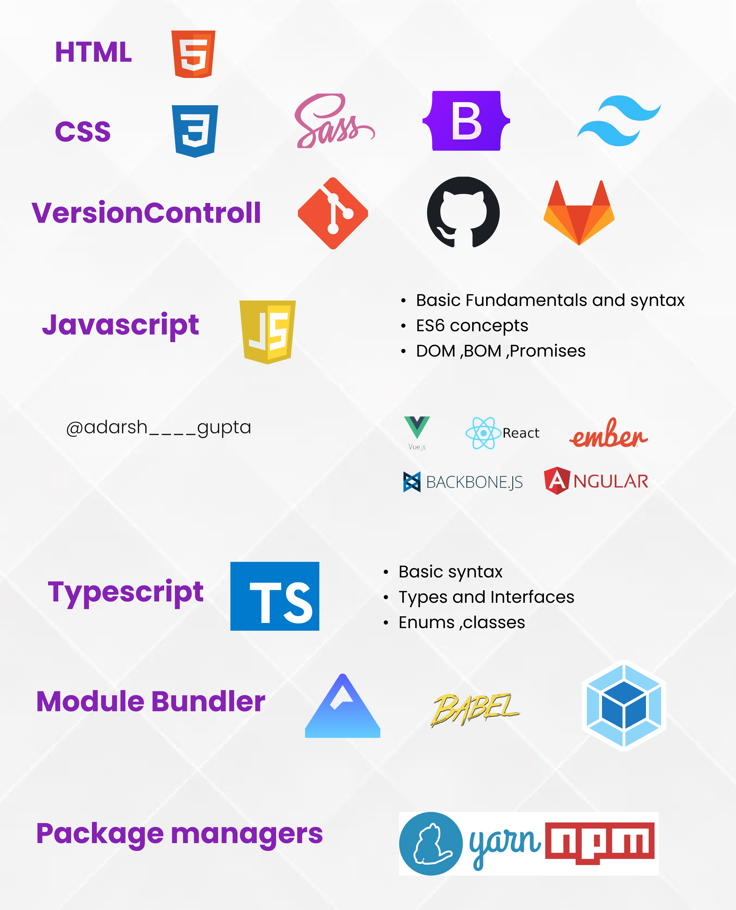

### All cheatsheets will come here  

       

### You can learn (!learn) from these booster cheatsheets which will help you have a idea or a just remember all things you forget in these good days

### All contents here are free to use ,unless you give credits to me😁....

### Spread the word ,Give it a 🌟

### The roadMap I chose

